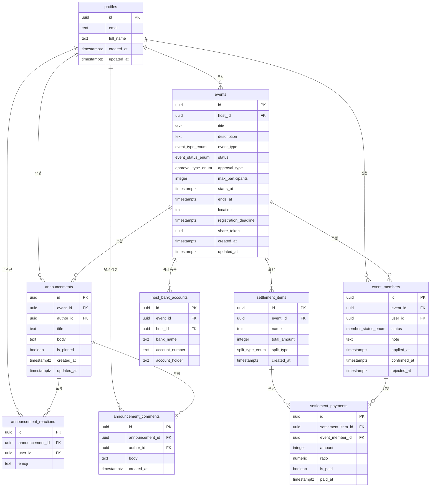

# Gather DB 스키마 설계 및 ERD

> **작성일**: 2026-04-18
> **작성 목적**: Phase 3 구현을 위한 DB 스키마 확정 및 테이블 관계 문서화
> **관련 태스크**: Task 017 (스키마 설계), Task 018 (마이그레이션 실행)

---

## 1. ERD (테이블 관계 다이어그램)



---

## 2. 테이블별 컬럼 정의

### 2-1. profiles (사용자 프로필)

Supabase Auth의 `auth.users`와 1:1 연결되는 공개 프로필 테이블.

| 컬럼명       | 타입          | 제약                      | 설명                              |
| ------------ | ------------- | ------------------------- | --------------------------------- |
| `id`         | `uuid`        | PK, REFERENCES auth.users | Auth 사용자 ID                    |
| `email`      | `text`        | NOT NULL                  | 이메일 주소                       |
| `full_name`  | `text`        |                           | 표시 이름 (nullable)              |
| `created_at` | `timestamptz` | DEFAULT now()             | 생성 일시                         |
| `updated_at` | `timestamptz` | DEFAULT now()             | 수정 일시 (트리거 자동 갱신 권장) |

> 기존 테이블 유지. `avatar_url`, `bio`, `username`, `website`는 MVP 이후 기능으로 컬럼은 존재하지만 UI에서는 사용하지 않음.

---

### 2-2. events (이벤트)

이벤트의 모든 기본 정보를 담는 핵심 테이블.

| 컬럼명                  | 타입                 | 제약                                        | 설명                                    |
| ----------------------- | -------------------- | ------------------------------------------- | --------------------------------------- |
| `id`                    | `uuid`               | PK, DEFAULT gen_random_uuid()               | 이벤트 고유 ID                          |
| `host_id`               | `uuid`               | NOT NULL, FK → auth.users                   | 주최자 ID                               |
| `title`                 | `text`               | NOT NULL                                    | 이벤트명                                |
| `description`           | `text`               |                                             | 이벤트 설명 (nullable)                  |
| `event_type`            | `event_type_enum`    | NOT NULL, DEFAULT 'one_time'                | 이벤트 유형 (일회성/정기)               |
| `status`                | `event_status_enum`  | NOT NULL, DEFAULT 'draft'                   | 이벤트 상태                             |
| `approval_type`         | `approval_type_enum` | NOT NULL, DEFAULT 'manual'                  | 참여 신청 승인 방식                     |
| `max_participants`      | `integer`            | NOT NULL                                    | 최대 참여 인원                          |
| `starts_at`             | `timestamptz`        | NOT NULL                                    | 이벤트 시작 일시                        |
| `ends_at`               | `timestamptz`        |                                             | 이벤트 종료 일시 (nullable)             |
| `location`              | `text`               |                                             | 장소 (nullable)                         |
| `registration_deadline` | `timestamptz`        |                                             | 참여 신청 마감 일시 (nullable)          |
| `share_token`           | `uuid`               | NOT NULL, UNIQUE, DEFAULT gen_random_uuid() | 공개 공유 링크 토큰 (`/events/[token]`) |
| `created_at`            | `timestamptz`        | DEFAULT now()                               | 생성 일시                               |
| `updated_at`            | `timestamptz`        | DEFAULT now()                               | 수정 일시 (트리거 자동 갱신 권장)       |

> PRD의 `public_slug`(text)를 `share_token`(uuid)으로 변경. 설계 결정 사항 섹션 참조.

---

### 2-3. event_members (이벤트 참여자)

참여 신청 및 상태를 관리하는 테이블. 이벤트별 1인 1신청 제약.

| 컬럼명         | 타입                 | 제약                                    | 설명                         |
| -------------- | -------------------- | --------------------------------------- | ---------------------------- |
| `id`           | `uuid`               | PK, DEFAULT gen_random_uuid()           | 참여 레코드 고유 ID          |
| `event_id`     | `uuid`               | NOT NULL, FK → events ON DELETE CASCADE | 소속 이벤트 ID               |
| `user_id`      | `uuid`               | NOT NULL, FK → auth.users               | 참여자 ID                    |
| `status`       | `member_status_enum` | NOT NULL, DEFAULT 'waiting'             | 참여 상태 (확정/대기/거절)   |
| `note`         | `text`               |                                         | 신청 시 남긴 메모 (nullable) |
| `applied_at`   | `timestamptz`        | NOT NULL, DEFAULT now()                 | 신청 일시                    |
| `confirmed_at` | `timestamptz`        |                                         | 확정 처리 일시 (nullable)    |
| `rejected_at`  | `timestamptz`        |                                         | 거절 처리 일시 (nullable)    |

**제약 조건**: `UNIQUE(event_id, user_id)` — 동일 이벤트 중복 신청 방지

---

### 2-4. announcements (공지)

이벤트별 공지사항. 고정 공지 우선 정렬 지원.

| 컬럼명       | 타입          | 제약                                    | 설명               |
| ------------ | ------------- | --------------------------------------- | ------------------ |
| `id`         | `uuid`        | PK, DEFAULT gen_random_uuid()           | 공지 고유 ID       |
| `event_id`   | `uuid`        | NOT NULL, FK → events ON DELETE CASCADE | 소속 이벤트 ID     |
| `author_id`  | `uuid`        | NOT NULL, FK → auth.users               | 작성자 ID (주최자) |
| `title`      | `text`        | NOT NULL                                | 공지 제목          |
| `body`       | `text`        | NOT NULL                                | 공지 본문          |
| `is_pinned`  | `boolean`     | NOT NULL, DEFAULT false                 | 고정 공지 여부     |
| `created_at` | `timestamptz` | DEFAULT now()                           | 생성 일시          |
| `updated_at` | `timestamptz` | DEFAULT now()                           | 수정 일시          |

---

### 2-5. announcement_comments (공지 댓글)

공지에 달리는 댓글. 확정 참여자와 주최자가 작성 가능.

| 컬럼명            | 타입          | 제약                                           | 설명         |
| ----------------- | ------------- | ---------------------------------------------- | ------------ |
| `id`              | `uuid`        | PK, DEFAULT gen_random_uuid()                  | 댓글 고유 ID |
| `announcement_id` | `uuid`        | NOT NULL, FK → announcements ON DELETE CASCADE | 소속 공지 ID |
| `author_id`       | `uuid`        | NOT NULL, FK → auth.users                      | 작성자 ID    |
| `body`            | `text`        | NOT NULL                                       | 댓글 본문    |
| `created_at`      | `timestamptz` | DEFAULT now()                                  | 생성 일시    |

---

### 2-6. announcement_reactions (이모지 리액션)

공지에 대한 이모지 리액션. 사용자-공지-이모지 조합으로 중복 방지.

| 컬럼명            | 타입   | 제약                                           | 설명               |
| ----------------- | ------ | ---------------------------------------------- | ------------------ |
| `id`              | `uuid` | PK, DEFAULT gen_random_uuid()                  | 리액션 고유 ID     |
| `announcement_id` | `uuid` | NOT NULL, FK → announcements ON DELETE CASCADE | 소속 공지 ID       |
| `user_id`         | `uuid` | NOT NULL, FK → auth.users                      | 리액션한 사용자 ID |
| `emoji`           | `text` | NOT NULL                                       | 이모지 문자        |

**제약 조건**: `UNIQUE(announcement_id, user_id, emoji)` — 같은 이모지 중복 리액션 방지

---

### 2-7. settlement_items (정산 항목)

이벤트별 비용 항목. 분담 방식별로 `settlement_payments`가 생성됨.

| 컬럼명         | 타입              | 제약                                    | 설명                               |
| -------------- | ----------------- | --------------------------------------- | ---------------------------------- |
| `id`           | `uuid`            | PK, DEFAULT gen_random_uuid()           | 항목 고유 ID                       |
| `event_id`     | `uuid`            | NOT NULL, FK → events ON DELETE CASCADE | 소속 이벤트 ID                     |
| `name`         | `text`            | NOT NULL                                | 항목명 (예: 숙박비, 식비)          |
| `total_amount` | `integer`         | NOT NULL                                | 항목 총액 (원화 정수, 소수점 없음) |
| `split_type`   | `split_type_enum` | NOT NULL, DEFAULT 'equal'               | 분담 방식 (균등/개별/비율)         |
| `created_at`   | `timestamptz`     | DEFAULT now()                           | 생성 일시                          |

---

### 2-8. settlement_payments (납부 현황)

정산 항목별 참여자 납부 레코드. 주최자가 납부 완료를 수동으로 체크.

| 컬럼명               | 타입           | 제약                                              | 설명                           |
| -------------------- | -------------- | ------------------------------------------------- | ------------------------------ |
| `id`                 | `uuid`         | PK, DEFAULT gen_random_uuid()                     | 납부 레코드 고유 ID            |
| `settlement_item_id` | `uuid`         | NOT NULL, FK → settlement_items ON DELETE CASCADE | 소속 정산 항목 ID              |
| `event_member_id`    | `uuid`         | NOT NULL, FK → event_members ON DELETE CASCADE    | 납부 담당 참여자 ID            |
| `amount`             | `integer`      | NOT NULL, DEFAULT 0                               | 납부 금액 (원화 정수)          |
| `ratio`              | `numeric(5,2)` |                                                   | 비율 분담 시 비율값 (nullable) |
| `is_paid`            | `boolean`      | NOT NULL, DEFAULT false                           | 납부 완료 여부                 |
| `paid_at`            | `timestamptz`  |                                                   | 납부 확인 처리 일시 (nullable) |

---

### 2-9. host_bank_accounts (주최자 계좌)

이벤트별 주최자 정산 계좌. 참여자가 계좌번호를 확인하여 입금.

| 컬럼명           | 타입   | 제약                                    | 설명                 |
| ---------------- | ------ | --------------------------------------- | -------------------- |
| `id`             | `uuid` | PK, DEFAULT gen_random_uuid()           | 계좌 고유 ID         |
| `event_id`       | `uuid` | NOT NULL, FK → events ON DELETE CASCADE | 소속 이벤트 ID       |
| `host_id`        | `uuid` | NOT NULL, FK → auth.users               | 주최자 ID (RLS 기준) |
| `bank_name`      | `text` | NOT NULL                                | 은행명               |
| `account_number` | `text` | NOT NULL                                | 계좌번호             |
| `account_holder` | `text` | NOT NULL                                | 예금주               |

---

## 3. ENUM 타입 정의

### 3-1. event_type_enum

이벤트 유형을 구분하는 열거형.

| 값          | 설명                                 |
| ----------- | ------------------------------------ |
| `one_time`  | 일회성 이벤트 (기본값)               |
| `recurring` | 정기 모임 (주기적으로 반복되는 행사) |

```sql
CREATE TYPE event_type_enum AS ENUM ('one_time', 'recurring');
```

---

### 3-2. event_status_enum

이벤트의 라이프사이클 상태.

| 값          | 설명                              |
| ----------- | --------------------------------- |
| `draft`     | 초안 상태 (공개되지 않음, 기본값) |
| `open`      | 공개 상태 (참여 신청 가능)        |
| `closed`    | 마감 상태 (신청 불가)             |
| `cancelled` | 취소된 이벤트                     |

```sql
CREATE TYPE event_status_enum AS ENUM ('draft', 'open', 'closed', 'cancelled');
```

---

### 3-3. approval_type_enum

참여 신청 승인 방식.

| 값       | 설명                                                 |
| -------- | ---------------------------------------------------- |
| `auto`   | 자동 승인 — 신청 즉시 `confirmed` 상태로 전환        |
| `manual` | 수동 승인 — 주최자가 명시적으로 확정해야 함 (기본값) |

```sql
CREATE TYPE approval_type_enum AS ENUM ('auto', 'manual');
```

---

### 3-4. member_status_enum

이벤트 참여자의 신청 상태.

| 값          | 설명                                    |
| ----------- | --------------------------------------- |
| `confirmed` | 확정됨 (공지·정산 페이지 접근 가능)     |
| `waiting`   | 대기 중 (정원 초과 또는 수동 승인 대기) |
| `rejected`  | 거절됨                                  |

```sql
CREATE TYPE member_status_enum AS ENUM ('confirmed', 'waiting', 'rejected');
```

---

### 3-5. split_type_enum

정산 항목의 비용 분담 방식.

| 값           | 설명                                         |
| ------------ | -------------------------------------------- |
| `equal`      | 균등 분담 — 확정 인원수로 동일 분할 (기본값) |
| `individual` | 개별 지정 — 각 참여자에게 직접 금액 입력     |
| `ratio`      | 비율 분담 — `ratio` 컬럼값에 따라 계산       |

```sql
CREATE TYPE split_type_enum AS ENUM ('equal', 'individual', 'ratio');
```

---

### 3-6. PaymentStatus — boolean 처리 결정

`lib/types/index.ts`의 View 모델에서 `PaymentStatus = "pending" | "paid"` enum으로 표현하고 있으나, **DB에서는 `is_paid boolean`으로 단순화**하였다.

**이유**:

- PRD 원안이 `is_paid: boolean`으로 설계됨
- MVP 범위에서 납부 상태는 "납부 완료"와 "미납" 두 가지만 필요
- boolean은 쿼리·RLS 조건에서 더 직관적이고 성능 효율적
- 향후 "환불", "부분 납부" 등 상태가 필요할 경우 컬럼을 enum으로 변경하거나 별도 컬럼을 추가하는 방식으로 확장 가능

**앱 레이어 변환**: `is_paid === true` → `"paid"`, `is_paid === false` → `"pending"`

---

## 4. View 모델 ↔ DB 컬럼 매핑

### 4-1. Event (이벤트)

| View 모델 필드 (`lib/types/index.ts`) | DB 컬럼 (`events`)      | 비고                                       |
| ------------------------------------- | ----------------------- | ------------------------------------------ |
| `id`                                  | `id`                    |                                            |
| `host` (UserProfile)                  | `host_id`               | FK, JOIN으로 profiles에서 조회             |
| `title`                               | `title`                 |                                            |
| `description`                         | `description`           |                                            |
| `type`                                | `event_type`            | camelCase → snake_case                     |
| `status`                              | `status`                |                                            |
| `approvalType`                        | `approval_type`         | camelCase → snake_case                     |
| `maxCapacity`                         | `max_participants`      | 필드명 변경                                |
| `confirmedCount`                      | (없음)                  | **쿼리 집계** — `event_members` COUNT      |
| `waitingCount`                        | (없음)                  | **쿼리 집계** — `event_members` COUNT      |
| `startDate`                           | `starts_at`             | 필드명 변경                                |
| `endDate`                             | `ends_at`               | 필드명 변경                                |
| `location`                            | `location`              |                                            |
| `registrationDeadline`                | `registration_deadline` | camelCase → snake_case                     |
| `shareToken`                          | `share_token`           | PRD의 `public_slug`에서 uuid 타입으로 변경 |
| `createdAt`                           | `created_at`            | camelCase → snake_case                     |
| `updatedAt`                           | `updated_at`            | camelCase → snake_case                     |

---

### 4-2. EventMember (이벤트 참여자)

| View 모델 필드 (`lib/types/index.ts`) | DB 컬럼 (`event_members`) | 비고                           |
| ------------------------------------- | ------------------------- | ------------------------------ |
| `id`                                  | `id`                      |                                |
| `eventId`                             | `event_id`                | camelCase → snake_case         |
| `user` (UserProfile)                  | `user_id`                 | FK, JOIN으로 profiles에서 조회 |
| `status`                              | `status`                  |                                |
| `note`                                | `note`                    |                                |
| `appliedAt`                           | `applied_at`              | camelCase → snake_case         |
| `confirmedAt`                         | `confirmed_at`            | camelCase → snake_case         |
| `rejectedAt`                          | `rejected_at`             | camelCase → snake_case         |

---

### 4-3. Announcement (공지)

| View 모델 필드 (`lib/types/index.ts`) | DB 컬럼 (`announcements`) | 비고                                              |
| ------------------------------------- | ------------------------- | ------------------------------------------------- |
| `id`                                  | `id`                      |                                                   |
| `eventId`                             | `event_id`                | camelCase → snake_case                            |
| `author` (UserProfile)                | `author_id`               | FK, JOIN으로 profiles에서 조회                    |
| `title`                               | `title`                   |                                                   |
| `content`                             | `body`                    | 필드명 변경                                       |
| `isPinned`                            | `is_pinned`               | camelCase → snake_case                            |
| `reactions` (AnnouncementReaction[])  | (없음)                    | **쿼리 집계** — `announcement_reactions` GROUP BY |
| `comments` (AnnouncementComment[])    | (없음)                    | **쿼리 집계** — `announcement_comments` JOIN      |
| `createdAt`                           | `created_at`              | camelCase → snake_case                            |
| `updatedAt`                           | `updated_at`              | camelCase → snake_case                            |

---

### 4-4. SettlementItem (정산 항목)

| View 모델 필드 (`lib/types/index.ts`) | DB 컬럼 (`settlement_items`) | 비고                                  |
| ------------------------------------- | ---------------------------- | ------------------------------------- |
| `id`                                  | `id`                         |                                       |
| `eventId`                             | `event_id`                   | camelCase → snake_case                |
| `name`                                | `name`                       |                                       |
| `totalAmount`                         | `total_amount`               | camelCase → snake_case                |
| `splitType`                           | `split_type`                 | camelCase → snake_case                |
| `payments` (SettlementPayment[])      | (없음)                       | **관계 JOIN** — `settlement_payments` |
| `createdAt`                           | `created_at`                 | camelCase → snake_case                |

---

### 4-5. SettlementPayment (납부 현황)

| View 모델 필드 (`lib/types/index.ts`) | DB 컬럼 (`settlement_payments`) | 비고                                |
| ------------------------------------- | ------------------------------- | ----------------------------------- |
| `id`                                  | `id`                            |                                     |
| `member` (EventMember)                | `event_member_id`               | FK, JOIN으로 event_members에서 조회 |
| `amount`                              | `amount`                        |                                     |
| `ratio`                               | `ratio`                         |                                     |
| `status` ("pending" \| "paid")        | `is_paid` (boolean)             | boolean → enum 변환 (섹션 3-6 참조) |
| `paidAt`                              | `paid_at`                       | camelCase → snake_case              |

---

### 4-6. HostBankAccount (주최자 계좌)

| View 모델 필드 (`lib/types/index.ts`) | DB 컬럼 (`host_bank_accounts`) | 비고                   |
| ------------------------------------- | ------------------------------ | ---------------------- |
| `id`                                  | `id`                           |                        |
| `eventId`                             | `event_id`                     | camelCase → snake_case |
| `bankName`                            | `bank_name`                    | camelCase → snake_case |
| `accountNumber`                       | `account_number`               | camelCase → snake_case |
| `accountHolder`                       | `account_holder`               | camelCase → snake_case |

---

### 4-7. EventSettlement (집계 View 모델)

`EventSettlement` 전체는 DB 단일 테이블이 아닌 여러 테이블의 집계 결과물.

| View 모델 필드 | 출처                                                              |
| -------------- | ----------------------------------------------------------------- |
| `eventId`      | `settlement_items.event_id`                                       |
| `items`        | `settlement_items` + `settlement_payments` JOIN                   |
| `bankAccount`  | `host_bank_accounts`                                              |
| `totalAmount`  | **쿼리 집계** — `settlement_items.total_amount` SUM               |
| `paidCount`    | **쿼리 집계** — `settlement_payments WHERE is_paid = true` COUNT  |
| `unpaidCount`  | **쿼리 집계** — `settlement_payments WHERE is_paid = false` COUNT |

---

## 5. 설계 결정 사항

### 5-1. share_token: uuid 타입 채택

**PRD 원안**: `public_slug text UNIQUE NOT NULL` — 짧고 읽기 쉬운 slug 문자열

**최종 결정**: `share_token uuid UNIQUE NOT NULL DEFAULT gen_random_uuid()` — UUID 타입

**근거**:

- UUID는 충돌 가능성이 사실상 0에 가까워 별도 중복 체크 로직 불필요
- 예측 불가능한 형태로 직접 URL 탐색(enumeration attack) 방어
- PostgreSQL의 `gen_random_uuid()` 내장 함수로 DB 레이어에서 자동 생성
- View 모델에서 `shareToken`으로 이미 통일되어 있어 네이밍 일관성 유지
- 가독성이 필요하다면 클라이언트에서 URL 인코딩(Base62 등)으로 단축 가능 (Phase 후반 검토)

---

### 5-2. host_bank_accounts: 이벤트별 구조 채택

**PRD 원안**: `host_id` 기준 사용자 단위 계좌 관리 (`host_bank_accounts.host_id`)

**최종 결정**: `event_id` + `host_id` 복합 구조 — 이벤트별 계좌 분리

**근거**:

- 주최자가 이벤트마다 다른 계좌를 사용하는 현실적 시나리오 지원 (개인계좌 vs 동호회 계좌 등)
- `event_id ON DELETE CASCADE`로 이벤트 삭제 시 계좌 정보도 자동 정리
- `host_id` 컬럼을 유지하여 RLS 정책(`auth.uid() = host_id`)에서 소유자 확인 용이
- 향후 사용자 단위 기본 계좌 기능이 필요하면 별도 `user_bank_accounts` 테이블 추가 가능

---

### 5-3. PaymentStatus: boolean 단순화

**View 모델 원안**: `PaymentStatus = "pending" | "paid"` enum 타입

**최종 결정**: `is_paid boolean NOT NULL DEFAULT false`

**근거**:

- MVP 요구사항에서 납부 상태는 "납부 완료"와 "미납" 두 가지만 필요 (PRD F009)
- boolean은 조건 쿼리(`WHERE is_paid = false`)와 RLS 정책에서 더 직관적
- 인덱스 효율이 boolean이 enum 대비 동등하거나 유리
- 앱 레이어에서 `is_paid ? "paid" : "pending"` 변환으로 View 모델 일관성 유지
- 향후 "환불", "부분 납부" 상태가 필요할 경우 `payment_status_enum` 컬럼으로 마이그레이션

---

## 6. 인덱스 권장 목록

| 테이블                 | 인덱스 대상                                         | 타입          | 이유                                                   |
| ---------------------- | --------------------------------------------------- | ------------- | ------------------------------------------------------ |
| `events`               | `host_id`                                           | BTREE         | 주최자 대시보드 이벤트 목록 조회 (`WHERE host_id = ?`) |
| `events`               | `share_token`                                       | UNIQUE (자동) | 공개 링크 조회 (`WHERE share_token = ?`)               |
| `event_members`        | `event_id`                                          | BTREE         | 이벤트별 참여자 전체 목록 조회                         |
| `event_members`        | `user_id`                                           | BTREE         | 사용자별 참여 이벤트 목록 조회 (대시보드)              |
| `event_members`        | `(event_id, status)`                                | 복합 BTREE    | 상태별 필터링 (`WHERE event_id = ? AND status = ?`)    |
| `announcements`        | `event_id`                                          | BTREE         | 이벤트별 공지 목록 조회                                |
| `announcements`        | `(event_id, is_pinned)`                             | 복합 BTREE    | 고정 공지 우선 정렬 쿼리 성능                          |
| `settlement_items`     | `event_id`                                          | BTREE         | 이벤트별 정산 항목 조회                                |
| `settlement_payments`  | `settlement_item_id`                                | BTREE         | 항목별 납부 현황 조회                                  |
| `settlement_payments`  | `event_member_id`                                   | BTREE         | 참여자별 납부 레코드 조회                              |
| `reminder_logs` (예정) | `(event_id, user_id, reminder_type, DATE(sent_at))` | 복합 BTREE    | 중복 리마인더 발송 방지 (F007, F009)                   |

> `UNIQUE` 제약 컬럼(`share_token`, `(event_id, user_id)`, `(announcement_id, user_id, emoji)`)은 PostgreSQL이 자동으로 UNIQUE INDEX를 생성함.

---

## 7. RLS 정책 설계 방향 (Task 018 구현 예정)

Task 018에서 아래 방향에 따라 RLS 정책을 구현할 예정이다.

### 정책 원칙

1. **최소 권한 원칙**: 필요한 작업에만 허용, 기본값은 차단
2. **소유자 기반 쓰기 제한**: INSERT/UPDATE/DELETE는 `auth.uid() = host_id` 또는 `auth.uid() = user_id` 조건 필수
3. **확정 참여자 접근 제어**: 공지·정산 정보는 `status = 'confirmed'` 참여자만 열람

### 테이블별 정책 요약

| 테이블                   | 주체        | 허용 작업                | 핵심 조건                                                                                                                        |
| ------------------------ | ----------- | ------------------------ | -------------------------------------------------------------------------------------------------------------------------------- |
| `profiles`               | 본인        | SELECT / UPDATE          | `auth.uid() = id`                                                                                                                |
| `profiles`               | 누구나      | SELECT                   | (공개 프로필 — 참여자 이름 표시용)                                                                                               |
| `events`                 | 누구나      | SELECT                   | `status != 'draft'`                                                                                                              |
| `events`                 | 주최자      | INSERT / UPDATE / DELETE | `auth.uid() = host_id`                                                                                                           |
| `event_members`          | 주최자      | SELECT / UPDATE          | `auth.uid() = (SELECT host_id FROM events WHERE id = event_id)`                                                                  |
| `event_members`          | 본인 참여자 | SELECT / INSERT          | `auth.uid() = user_id`                                                                                                           |
| `announcements`          | 확정 참여자 | SELECT                   | `EXISTS (SELECT 1 FROM event_members WHERE event_id = announcements.event_id AND user_id = auth.uid() AND status = 'confirmed')` |
| `announcements`          | 주최자      | ALL                      | `auth.uid() = author_id`                                                                                                         |
| `announcement_comments`  | 확정 참여자 | SELECT / INSERT          | 이벤트 확정 참여자 조건 (위와 동일)                                                                                              |
| `announcement_reactions` | 확정 참여자 | SELECT / INSERT / DELETE | 본인 리액션만 삭제 가능 (`auth.uid() = user_id`)                                                                                 |
| `settlement_items`       | 확정 참여자 | SELECT                   | 이벤트 확정 참여자 조건                                                                                                          |
| `settlement_items`       | 주최자      | ALL                      | `auth.uid() = (SELECT host_id FROM events WHERE id = event_id)`                                                                  |
| `settlement_payments`    | 본인 참여자 | SELECT                   | `auth.uid() = (SELECT user_id FROM event_members WHERE id = event_member_id)`                                                    |
| `settlement_payments`    | 주최자      | UPDATE                   | `auth.uid() = (SELECT host_id FROM events e JOIN settlement_items si ON si.event_id = e.id WHERE si.id = settlement_item_id)`    |
| `host_bank_accounts`     | 확정 참여자 | SELECT                   | 이벤트 확정 참여자 조건                                                                                                          |
| `host_bank_accounts`     | 주최자      | ALL                      | `auth.uid() = host_id`                                                                                                           |

---

## 8. Phase 3 공통 API 응답 타입 (예정)

`lib/types/api.ts`에 추가할 타입 인터페이스. Server Action과 Route Handler의 응답 타입을 통일하여 클라이언트 오류 처리를 일관성 있게 구현.

```typescript
/**
 * Server Action 및 Route Handler 공통 응답 타입
 * 성공 시 data 필드, 실패 시 error + code 필드를 반환
 */
type ActionResult<T> =
  | { success: true; data: T }
  | { success: false; error: string; code?: ActionErrorCode };

/**
 * 표준화된 에러 코드
 * 클라이언트에서 에러 유형별 UI 처리에 활용
 */
type ActionErrorCode =
  | "UNAUTHORIZED" // 미인증 사용자 접근
  | "FORBIDDEN" // 권한 없음 (다른 사용자 리소스 접근)
  | "NOT_FOUND" // 리소스 없음
  | "VALIDATION" // Zod 등 입력값 검증 실패
  | "CAPACITY_FULL" // 이벤트 정원 초과 (대기자 처리 분기)
  | "DUPLICATE" // 중복 신청 등 유니크 제약 위반
  | "INTERNAL"; // 예기치 않은 서버 에러
```

**활용 예시**:

```typescript
// Server Action에서
export async function applyToEvent(eventId: string): Promise<ActionResult<EventMember>> {
  const supabase = await createClient();
  const {
    data: { user },
  } = await supabase.auth.getUser();

  if (!user) return { success: false, error: "로그인이 필요합니다.", code: "UNAUTHORIZED" };

  // ... 정원 초과 체크
  if (isFull) return { success: false, error: "정원이 초과되었습니다.", code: "CAPACITY_FULL" };

  // ... INSERT 처리
  return { success: true, data: member };
}

// 클라이언트에서
const result = await applyToEvent(eventId);
if (!result.success) {
  if (result.code === "CAPACITY_FULL") {
    // 대기자 신청 UI로 전환
  }
}
```

---

## 변경 이력

| 날짜       | 버전 | 변경 내용          |
| ---------- | ---- | ------------------ |
| 2026-04-18 | v1.0 | Task 017 최초 작성 |
